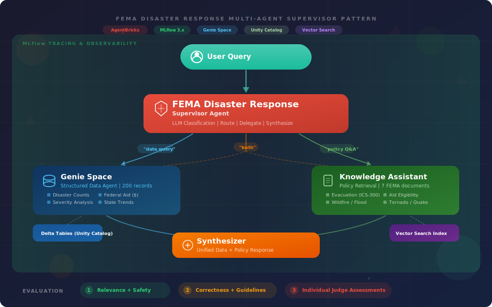

# FEMA Multi-Agent Supervisor — Databricks Asset Bundle

A Databricks Asset Bundle that deploys a **multi-agent supervisor** for FEMA disaster response using 100% Databricks-native components (AgentBricks, Genie Space, Vector Search, Unity Catalog).

## Architecture



| Subagent | Purpose | Databricks Component |
|----------|---------|---------------------|
| **Genie Agent** | Structured data queries (SQL, stats, trends) | Genie Space -> Unity Catalog table |
| **Knowledge Assistant** | Policy/procedure Q&A over documents | AgentBricks KA -> Vector Search index |
| **Supervisor** | Routes, delegates, synthesizes | AgentBricks Supervisor Agent |

## Prerequisites

- **Databricks CLI** v0.218.0+ (`databricks --version`)
- **Workspace access** with permissions to create: UC catalog/schema/tables, Genie Spaces, Vector Search endpoints, AgentBricks agents
- **Authentication** configured (`databricks auth login --host https://<workspace>.cloud.databricks.com`)

## Quick Start

### 1. Configure

Edit `databricks.yml` — update the `workspace.host` under `targets.dev` with your workspace URL.

### 2. Deploy

```bash
databricks bundle deploy \
  --var="catalog=<your-catalog>" \
  --var="warehouse_id=<your-warehouse-id>"
```

> **Note:** `warehouse_id` is required for Genie Space creation. Find it in the workspace under **SQL Warehouses** (the hex ID in the URL or ID column). `catalog` defaults to `jules_catalog` if omitted.

### 3. Run the setup job

```bash
databricks bundle run setup_demo \
  --var="catalog=<your-catalog>" \
  --var="warehouse_id=<your-warehouse-id>"
```

This runs two tasks on serverless compute:

| Task | Notebook | What it does |
|------|----------|-------------|
| `load_data` | `src/load_data.py` | Create UC catalog/schema, load 200 FEMA disaster records, write 7 policy docs with CDF |
| `create_agents` | `src/create_agents.py` | Create Genie Space, Vector Search endpoint + index, Knowledge Assistant via SDK |

### 4. Manual step — Create Supervisor Agent

After the job completes:

1. Go to **Agents** in the workspace sidebar
2. From the **Supervisor Agent** tile, click **Build**
3. Add subagents:
   - The **Genie Space** (`FEMA Disaster Data`) created by the job
   - The **Knowledge Assistant** (`FEMA Policy Assistant`) created by the job
4. Name it: `FEMA Disaster Response Supervisor`
5. Add instructions (printed at the end of the `create_agents` task output)
6. Copy the **endpoint name** from "See Agent status"

### 5. Test and evaluate (standalone notebooks)

The query and evaluation notebooks are not part of the automated job — they require the Supervisor endpoint to exist first. Run them interactively after setting `supervisor_endpoint`:

- `src/04_query_supervisor.py` — 6 test queries across all routing paths
- `src/05_evaluate.py` — MLflow GenAI evaluation + individual judge assessments

## File Structure

```
fema-disaster/
├── databricks.yml          # Bundle config: 2-task job, variables, serverless
├── src/
│   ├── load_fema_data.py   # Library: generates FEMA disaster data
│   ├── setup_agents.py     # Library: Genie, Vector Search, KA creation
│   ├── load_data.py        # Notebook (task 1): loads data into UC
│   ├── create_agents.py    # Notebook (task 2): creates all agents
│   ├── 04_query_supervisor.py  # Standalone: test queries
│   └── 05_evaluate.py         # Standalone: MLflow evaluation
├── README.md
└── .gitignore
```

## Variables

Override any variable at deploy time with `--var key=value`:

| Variable | Default | Description |
|----------|---------|-------------|
| `catalog` | `jules_catalog` | Unity Catalog catalog name |
| `schema` | `fema_demo` | Schema for FEMA demo tables |
| `table_name` | `disaster_data` | FEMA disaster data table name |
| `policy_table_name` | `policy_docs` | Policy documents table name |
| `vs_endpoint_name` | `fema_vs_endpoint` | Vector Search endpoint name |
| `embedding_model` | `databricks-gte-large-en` | Embedding model for Vector Search |
| `warehouse_id` | *(required)* | SQL Warehouse ID (for Genie Space) |

## Development Workflow using DABs

```bash
databricks bundle validate -t dev
databricks bundle deploy \
  --var="catalog=<your-catalog>" \
  --var="warehouse_id=<your-warehouse-id>"
databricks bundle run setup_demo \
  --var="catalog=<your-catalog>" \
  --var="warehouse_id=<your-warehouse-id>"
databricks bundle destroy -t dev
```

## CLI Usage (without DAB)

The library modules also work standalone:

```bash
python src/setup_agents.py --catalog jules_catalog --schema fema_demo --vs-endpoint fema_vs_endpoint --warehouse-id <id>
```
