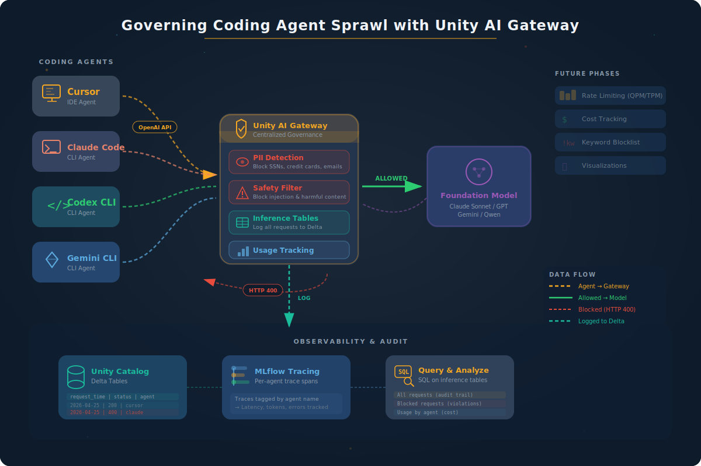

# Governing Coding Agent Sprawl with Unity AI Gateway



**The problem:** Your organization has dozens of developers using Cursor, Claude Code, Codex CLI, and Gemini CLI. Each agent calls a different LLM provider with its own API key. You have no visibility into who is spending what, no guardrails against data leaks, and no audit trail.

**The solution:** Route every coding agent through a single Unity AI Gateway endpoint. This notebook demonstrates the three governance pillars:

| Pillar | What it does |
|--------|--------------|
| **Security & Audit** | Guardrails (PII detection, prompt injection, safety filters), all requests logged to Unity Catalog |
| **Cost Management** | Rate limiting (QPM/TPM), unified billing, budget allocation per user/group |
| **Observability** | Inference tables in Delta, per-user metrics, usage dashboards |

> **Reference:** [Governing Coding Agent Sprawl with Unity AI Gateway](https://www.databricks.com/blog/governing-coding-agent-sprawl-unity-ai-gateway)

## What the demo covers

The notebook walks through four acts:

1. **Act 1 — Configure the Gateway** — Programmatic setup of PII detection (BLOCK mode), safety filters, inference tables, and usage tracking via the Databricks SDK
2. **Act 2 — Simulate the Coding Agent Swarm** — Four simulated coding agents (Cursor, Claude Code, Codex CLI, Gemini CLI) send legitimate coding requests through the same gateway endpoint
3. **Act 3 — Guardrails in Action** — PII (SSNs, credit cards) and prompt injection attempts are blocked in real time with HTTP 400 responses
4. **Act 4 — The Audit Trail** — Query inference tables in Delta showing all requests, including blocked ones, for compliance and cost tracking

## Prerequisites

- Databricks workspace with Unity Catalog enabled
- An existing serving endpoint backed by a foundation model (e.g., `databricks-gpt-5-4`, `databricks-claude-sonnet-4`)
- `CAN_MANAGE` permission on the serving endpoint (to configure AI Gateway)
- `CREATE TABLE` permission on the target catalog/schema (for inference tables)
- Databricks personal access token

## Setup

```bash
# From the mlflow-demos root
cp ai_gateway_governance/env-template ai_gateway_governance/.env
# Edit .env with your values (see env-template for required variables)

uv sync
```

### Environment variables

| Variable | Description |
|----------|-------------|
| `DATABRICKS_HOST` | Workspace URL (e.g., `https://<workspace>.cloud.databricks.com`) |
| `DATABRICKS_TOKEN` | Personal access token |
| `AI_GATEWAY_ENDPOINT_NAME` | Name of your serving endpoint |
| `AI_GATEWAY_MODEL` | Foundation model name (e.g., `databricks-gpt-5-4`) |
| `UC_CATALOG` | Unity Catalog catalog for inference tables |
| `UC_SCHEMA` | Unity Catalog schema for inference tables |

## Running

**On Databricks:** Upload the notebook and all `.py` modules to a Databricks workspace. The notebook uses `spark` and `display()` for querying inference tables in Act 4.

**Locally:** Run the notebook with Jupyter. Acts 1–3 work locally. The observability cells (Act 4) require a Databricks notebook runtime for `spark` — skip them when running locally.

## File structure

```
ai_gateway_governance/
├── ai_gateway_demo.ipynb   # Main demo notebook
├── gateway_config.py       # GatewayConfig dataclass + SDK helpers for AI Gateway setup
├── agent_simulator.py      # SimulatedAgent, GatewayClient, request handling with retry
├── scenarios.py            # Test payloads: clean requests, PII, prompt injection
├── prompts.py              # System prompts for each coding agent persona
├── observability.py        # SQL query templates for inference tables
├── images/
│   └── ai_gateway_architecture.svg
├── env-template            # Environment variable template
└── README.md
```
