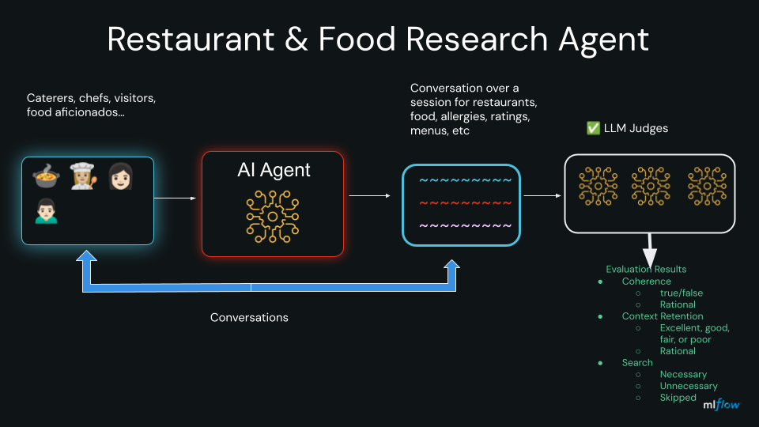

# DevConnect Demo — Restaurant Research Bot

A multi-turn conversational agent that researches restaurants using live web search, evaluated with **MLflow session-level judges**. The agent demonstrates how to build, trace, and score a tool-augmented LLM application end-to-end.



This multi-turn conversational agent can be used by **Caspers Kitchens'** clients or customers, caterers, or anyone interested in researching restaurants catered by kitches such as 
**Caspers Kitchens** for the following scenarios:

* **Food allergies** — identify dishes and restaurants that accommodate specific dietary restrictions (e.g. peanut-free, gluten-free, vegan)
* **Restaurant ratings & recommendations** — discover highly rated restaurants by neighborhood, cuisine, or preference
* **Food safety inspections** — look up health inspection scores and recent violation reports for a specific restaurant
* **Menu & hours** — find current operating hours, menus, and vegetarian or allergen-friendly options
* **Personalized recommendations** — get synthesized advice across multiple turns, with the agent remembering your preferences throughout the conversation


## What the demo shows

- **Tool-use loop** — the agent calls `web_search()` (Tavily) when it needs current data, feeds results back, and loops until the LLM produces a final answer
- **Session history** — every turn shares full conversation context so the agent can construct contextual search queries (e.g. it resolves "that restaurant" → "Nopa San Francisco" from prior turns)
- **MLflow tracing** — each conversation turn becomes a `CHAT_MODEL` span; every `web_search()` call is a nested `TOOL` span inside it
- **Session-level evaluation** — three LLM judges receive the entire conversation at once (via the `{{ conversation }}` template) and score coherence, context retention, and search quality

---

## Prerequisites

| Requirement | Version |
|---|---|
| Python | 3.10+ |
| [uv](https://docs.astral.sh/uv/) | latest |
| MLflow tracking server | running locally or remote |

Install dependencies from the repo root:

```bash
uv sync
```

---

## API keys

The demo requires up to three API keys depending on which provider you use.

### OpenAI (default)

Used for the agent LLM and the judge LLMs.

1. Go to [platform.openai.com/api-keys](https://platform.openai.com/api-keys)
2. Click **Create new secret key**
3. Copy the key — it starts with `sk-`

```
OPENAI_API_KEY=sk-...
```

### Tavily (web search — always required)

Used by `web_search()` for all providers. The free tier is sufficient for demos.

1. Go to [app.tavily.com](https://app.tavily.com) and sign up
2. Your API key is shown on the dashboard — it starts with `tvly-`

```
TAVILY_API_KEY=tvly-...
```

### Databricks (only if using `--provider databricks`)

Used to access Databricks-hosted models (Foundation Model APIs).

1. Open your Databricks workspace
2. Click your username in the top-right → **Settings** → **Developer** → **Access tokens**
3. Click **Generate new token**, set a lifetime, copy the token (starts with `dapi`)
4. Copy your workspace URL from the browser address bar (e.g. `https://adb-123.azuredatabricks.net`)

```
DATABRICKS_HOST=https://<your-workspace>.cloud.databricks.com
DATABRICKS_TOKEN=dapi...
```

### Configure your `.env` file

Copy the template into the bot directory and fill in your values:

```bash
cp env-template devconnect/restaurant_research_bot/.env
```

Edit `devconnect/restaurant_research_bot/.env`:

```bash
OPENAI_API_KEY=sk-...
TAVILY_API_KEY=tvly-...
OPENAI_API_BASE=https://api.openai.com/v1
MLFLOW_TRACKING_URI=http://localhost:5000

# Databricks (only if using --provider databricks)
DATABRICKS_HOST=https://<your-workspace>.cloud.databricks.com
DATABRICKS_TOKEN=dapi...
```

---

## Start the MLflow tracking server

All three run modes require a running MLflow server to store traces and evaluation results.

```bash
mlflow server --backend-store-uri sqlite:///mlflow.db --port 5000
```

Open the UI at [http://localhost:5000](http://localhost:5000). After a run you will see a `restaurant-research-bot` experiment with one MLflow run per scenario.

---

## Run the CLI

The CLI runs one or all scenarios, prints turn-by-turn output, then prints judge scores.

```bash
# Run all four scenarios with OpenAI (default)
uv run mlflow-restaurant-research-bot

# Run a single scenario by short name
uv run mlflow-restaurant-research-bot --scenario restaurant
uv run mlflow-restaurant-research-bot --scenario safety
uv run mlflow-restaurant-research-bot --scenario allergen
uv run mlflow-restaurant-research-bot --scenario nosearch

# Override model
uv run mlflow-restaurant-research-bot --model gpt-4o

# Print evaluation DataFrame columns and raw results
uv run mlflow-restaurant-research-bot --debug
```

### CLI output

```
============================================================
Multi-Turn Web-Search Bot  |  MLflow Session Evaluation
============================================================

  Provider:    openai
  Model:       gpt-5-mini
  Judge model: gpt-5-mini
  Experiment:  restaurant-research-bot

Turn 1/4
  User: What are some highly rated Italian restaurants in Chicago's River North neighborhood?
  Bot:  Here are some well-regarded options...
...
────────────────────────────────────────
  Coherence:         PASS  (True)
  Context Retention: EXCELLENT
  Search Quality:    NECESSARY
```

---

## Run with Databricks

Switch the provider to use Databricks Foundation Model APIs for both the agent and judges. Requires `DATABRICKS_HOST` and `DATABRICKS_TOKEN` in your `.env`.

```bash
uv run mlflow-restaurant-research-bot \
  --provider databricks \
  --model databricks-gpt-5-mini

# Use a different judge model
uv run mlflow-restaurant-research-bot \
  --provider databricks \
  --model databricks-gpt-5-mini \
  --judge-model databricks-gemini-2-5-flash
```

The `--provider` flag switches both the agent model and the provider context for LiteLLM. The `--judge-model` flag lets you use a different (often cheaper/faster) model for the three evaluation judges.

---

## Run the notebook

The notebook walks through the same demo interactively — recommended for presentations or self-paced exploration.

**1. Start the MLflow tracking server** (if not already running):

```bash
mlflow server --backend-store-uri sqlite:///mlflow.db --port 5000
```

**2. Launch Jupyter:**

```bash
jupyter notebook devconnect/restaurant_research_bot/restaurant_research_agent_devconnect.ipynb
```

**3. Run all cells** in order. The notebook:
- Loads credentials from `.env`
- Sets the MLflow experiment
- Runs the Food Safety scenario
- Evaluates the session with all three judges
- Displays scores inline

---

## Scenarios

Each scenario tests a different aspect of multi-turn agent behaviour.

| Short name | Full name | What it tests |
|---|---|---|
| `restaurant` | Restaurant Research | Multi-turn discovery; turn 4 must synthesise from prior turns without re-searching |
| `safety` | Food Safety Research | Resolves implicit reference ("that restaurant") into a concrete query using conversation history |
| `allergen` | Silent Allergen Carryover | Peanut allergy stated once in turn 1; must silently appear in a turn-4 search query |
| `nosearch` | No-Search Needed | Correct behaviour = zero searches; tests that the agent doesn't over-search on general knowledge |

---

## Evaluation judges

All three judges use the `{{ conversation }}` template, which tells `mlflow.genai.evaluate()` to pass the **entire session** (all turns) to each judge rather than scoring turn by turn.

| Judge | Output type | What it scores |
|---|---|---|
| `conversation_coherence` | `bool` | Does the conversation flow logically? Are responses relevant and non-contradictory? |
| `context_retention` | `excellent / good / fair / poor` | Does the agent remember constraints stated in earlier turns (allergies, location, preferences)? |
| `search_quality` | `necessary / unnecessary / skipped` | Did the agent search at the right times — and skip when general knowledge was sufficient? |

---

## File layout

```
devconnect/
├── config.py
├── mlflow_config.py
├── providers.py
└── restaurant_research_bot/
    ├── restaurant_research_agent_cls.py
    ├── restaurant_research_agent.py
    ├── restaurant_research_agent_devconnect.ipynb
    ├── scenarios.py
    ├── prompts.py
    └── search_tool.py
```

### Shared modules (`devconnect/`)

| File | Description |
|---|---|
| `config.py` | `AgentConfig` dataclass — holds `provider`, `model`, `temperature`, and credentials. Reads `OPENAI_API_KEY` / `DATABRICKS_*` from the environment automatically. |
| `mlflow_config.py` | `setup_mlflow_tracking()` — sets the tracking URI, calls `mlflow.openai.autolog()`, and creates or selects the experiment by name. |
| `providers.py` | `get_client(provider)` — returns an OpenAI-compatible client. For `"databricks"` it points the base URL at `<DATABRICKS_HOST>/serving-endpoints`; for `"openai"` it uses the standard OpenAI endpoint. |

### Bot modules (`devconnect/restaurant_research_bot/`)

| File | Description |
|---|---|
| `restaurant_research_agent_cls.py` | `RestaurantResearchAgent` — the core agent class. Owns the tool-use loop, session history, MLflow tracing, and `evaluate_session()`. |
| `restaurant_research_agent.py` | CLI entry point. Parses `--provider`, `--model`, `--judge-model`, `--scenario`, and `--debug` flags, then drives the agent through one or all scenarios. |
| `restaurant_research_agent_devconnect.ipynb` | Interactive notebook version of the demo. Runs the Food Safety scenario and displays evaluation scores inline. |
| `scenarios.py` | Four `get_scenario_*()` functions returning conversation message lists and expected judge scores. Also provides `get_all_scenarios()` and `get_scenario_by_name()`. |
| `prompts.py` | System prompt with explicit search query construction guidance, plus the three judge instruction strings (each using the `{{ conversation }}` template). |
| `search_tool.py` | `web_search(query)` — calls the Tavily API, formats the response, and exposes `WEB_SEARCH_TOOL_SCHEMA` for OpenAI function calling. Decorated with `@mlflow.trace` so each call appears as a child `TOOL` span. |
