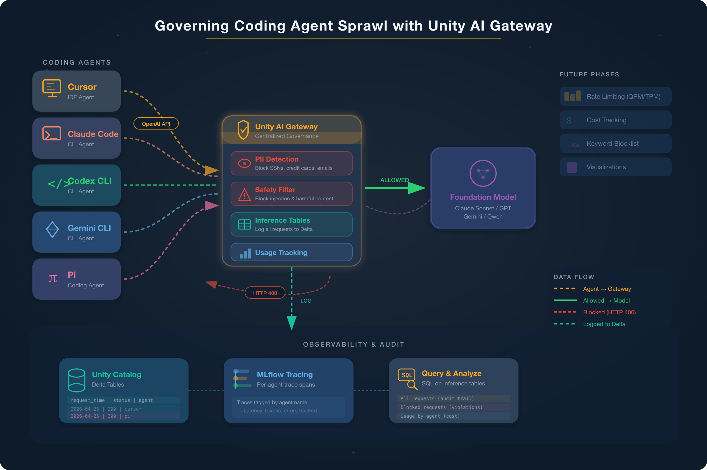

# Governing Coding Agent Sprawl with Unity AI Gateway



**The problem:** Your organization has dozens of developers using multiple coding harnesses: Cursor, Claude Code, Codex CLI, Gemini CLI, and Pi — spread across different model providers. Each agent calls an LLM with its own API key. You have no visibility into who is spending what, no guardrails against data leaks, and no audit trail.

**The solution:** Route every coding agent through Databricks Unity AI Gateway, to a **provider-specific governed model service** (Claude, OpenAI, Gemini). Each service is a Unity Catalog securable named `catalog.schema.service`, with its **own** guardrail policies, inference table, and rate limits — so each provider is governed independently while every request flows through one gateway. This notebook demonstrates the three governance and security pillars:

| Pillar | What it does |
|--------|--------------|
| **Security & Auditability** | Per-service guardrails (PII detection, jailbreak, unsafe content), requests logged to Unity Catalog inference tables |
| **Cost Management** | Per-service rate limiting (QPM/TPM), unified billing, budget allocation per user/group |
| **Observability** | Inference tables in Delta (one per service), per-provider metrics, usage dashboard, and MLflow tracing |

> **Reference:** [Governing Coding Agent Sprawl with Unity AI Gateway](https://www.databricks.com/blog/governing-coding-agent-sprawl-unity-ai-gateway)

## What the demo covers

The notebook walks through six acts:

1. **Act 1 — Verify the Gateway** — Verify all three model services and read back each one's **deployed** configuration from Unity Catalog: guardrail policies and the phases they run in, the routed model, the inference table, and rate-limit / usage-tracking settings. Fails fast, and warns when rate limits are missing
2. **Act 2 — Simulate the Coding Agent Swarm** — Five simulated coding agents, each with its own persona system prompt, routed to **its provider's model service**: Cursor and Claude Code → Claude, Codex CLI → OpenAI, Gemini CLI and Pi → Gemini. Each agent sends **10 realistic coding requests (50 in total)** — linked lists, binary search, decorators, config and IaC, code review — drawn from the catalog in `clean_tasks.py` and issued round-robin so the provider rotates on every call. That volume is what gives the audit and chargeback questions in Acts 4 and 5 something real to answer. Every MLflow trace is tagged with `agent`, `provider`, and `model_service` for per-agent and per-provider attribution. **Budget 4–10 minutes** for this act; the catalog holds 15 tasks per agent, so raising `CLEAN_PER_AGENT` in the notebook to 15 gives 75 requests with no other change
3. **Act 3 — Guardrails in Action** — PII (SSNs, credit cards, emails/phones), jailbreaks, and unsafe-content requests are denied by each service's own policies, with every provider exercising all three policy types. Unsafe content also shows **defense-in-depth**: what the gateway lets through is still refused by the model
4. **Act 4 — The Audit Trail** — Use Databricks Genie to explore the three inference tables in plain English — no SQL required. Note these record requests that reached a model; policy-denied requests are not logged here
5. **Act 5 — Usage Tracking** — Token consumption and latency per provider, plus billing-grade hourly aggregates from `system.ai_gateway.usage` across all three services — the chargeback view showing which provider is spending what
6. **Act 6 — Rate Limiting** — Two burst tests against **different providers** show that budgets are per-service: a **QPM** burst (25 tiny requests, Claude) trips the queries-per-minute ceiling, and a **TPM** burst (8 large requests, OpenAI) trips the tokens-per-minute ceiling. Early requests pass (HTTP 200), later ones are rejected (HTTP 429) without retry.
7. **Act 7 - MLflow Tracing** -- all blocked requests, including the blocked requests, are recorded as traces in the Unity Catalog. You peruse them via the Experiment tag as well as query its tables using Genie Agent. 

## Prerequisites

- Databricks workspace with Unity Catalog enabled
- Databricks personal access token (for local runs)
- Prefconfigure all Unity AI Gateway Endpoints and associated tables in the Unity Catalog.

### Configure three model services in the Databricks UI

The notebook is a pure **consumer** of pre-existing model services — it does not create or reconfigure them. Create **three** services in your workspace, one per provider, and give each the **same** guardrail and rate-limit policies so only the routed model differs:

| Provider | Routed model | Agents that use it |
|----------|--------------|--------------------|
| Claude | e.g. `databricks-claude-opus-4-8` | Cursor, Claude Code |
| OpenAI | e.g. `databricks-gpt-5-6-sol` | Codex CLI |
| Gemini | e.g. `databricks-gemini-3-6-flash` | Gemini CLI, Pi |

Repeat these steps **for each** of the three:

1. **Create the model service** — add a new AI Gateway **model service** and pick the foundation model it routes to. It is created as a Unity Catalog securable named `catalog.schema.service`; that fully-qualified name is what the notebook sends in the request's `model` field.

2. **Configure guardrails** — under **Guardrails**, enable:
   - **PII Detection** — set mode to **Block** to reject requests containing SSNs, credit card numbers, emails, phone numbers, and names
   - **Jailbreak and Prompt Injection** — enable to block DAN prompts and attempts to extract system instructions
   - **Unsafe Content** — enable to block unsafe content

   Enable each on **both** the request (`pre_call`) and response (`post_call`) phases where offered — Act 1 prints the phases actually configured.

3. **Enable inference tables** — turn on logging and point it at a Unity Catalog schema. The table is named `<service-name>_payload`. **Check the destination schema carefully:** the table can end up in a different schema than the service itself, which makes the Act 4/5 Genie setup confusing. Act 1 discovers the real path and warns when it doesn't match.

4. **Enable usage tracking** — turn on **Usage Tracking** to capture per-request token counts. Without it, `system.ai_gateway.usage` returns no rows and Act 5's chargeback query is empty.

5. **Configure rate limits** — set both a QPM (queries-per-minute) and a TPM (tokens-per-minute) limit. This powers the two burst tests in Act 6; **without limits, every burst request returns HTTP 200 and Act 6 shows nothing.** Recommended demo values (per user *and* per service):

   | Limit | Value | Why |
   |-------|-------|-----|
   | **QPM** (calls/min) | `8` | Well below the 25-request QPM burst, so the queries-per-minute ceiling is clearly hit part-way through. (The gateway allows some burst above the nominal limit, so set QPM comfortably under the burst size for a clean cutoff.) |
   | **TPM** (tokens/min) | `2000` | Low enough that the 8 large code-review requests exhaust the token budget after 1–2 calls |

   > **Note:** QPM and TPM are enforced independently — whichever ceiling is hit first triggers the 429. Keep TPM high enough (relative to the tiny QPM-test requests, ≈90 tokens each) that the QPM test is bound by the *call* limit, not the token limit; and keep TPM low enough that the large TPM-test requests are bound by the *token* limit. Skip this step entirely if you want all requests to pass through (HTTP 200).

   > **These values are tuned for Act 6 and will choke Act 2.** Limits are per-service, so one setting has to serve both acts. Act 2 sends 50 requests averaging ~1,100 tokens each; against `QPM=8` / `TPM=2000` most of them draw a 429 and fall back on retry backoff, turning a 4–10 minute act into something far longer. Two workable options:
   >
   > * **Leave limits unset** (the default) while running Acts 1–5, then set them just before demoing Act 6. Acts 1–5 don't depend on rate limiting.
   > * **Or raise them** for the volume acts — roughly `QPM=60` / `TPM=100000` covers 50 requests comfortably — and drop to `8` / `2000` for Act 6.
   >
   > If Act 2 reports requests that "exhausted retries on HTTP 429", this is why.

Once all three are configured, copy each service's fully-qualified name (`catalog.schema.service`) into the matching `*_MODEL_SERVICE` variable in `.env` — or into the notebook's config cell when running on Databricks.

### How agents reach the gateway

All three services share **one** URL, and the `model` field selects which one handles the request:

```bash
curl $DATABRICKS_HOST/ai-gateway/mlflow/v1/chat/completions \
  -H "Content-Type: application/json" \
  -H "Authorization: Bearer $DATABRICKS_TOKEN" \
  -d '{
    "model": "catalog.schema.service",
    "max_tokens": 1024,
    "messages": [{"role": "user", "content": "What is Databricks?"}]
  }'
```

Because the API is OpenAI-compatible, pointing a real coding agent at the gateway is just a `base_url` change:

```python
from openai import OpenAI

client = OpenAI(
    api_key=os.environ["DATABRICKS_TOKEN"],
    base_url=f"{DATABRICKS_HOST}/ai-gateway/mlflow/v1",
)
client.chat.completions.create(
    model="catalog.schema.service",   # selects the governed service
    messages=[{"role": "user", "content": "What is Databricks?"}],
    max_tokens=1024,
)
```

That `model` value is both the routing key and the governance boundary — it decides which service's guardrails and rate limits apply.

### Reading a guardrail block

A blocked request returns **HTTP 200**, not an error status. The verdict is in the response body:

```json
{
  "choices": [{
    "message": {"content": "This request was blocked by the 'PII' service policy."},
    "finish_reason": "content_filter"
  }],
  "databricks_service_policy": {
    "name": "PII",
    "action": "deny",
    "phase": "pre_call",
    "reason": "Content contains a social security number: 539-48-2817."
  }
}
```

So detect blocks via `databricks_service_policy.action == "deny"` (see `detect_policy_block` in `agent_simulator.py`) — **filtering on `status_code != 200` will not find them.**

Two consequences worth knowing before you build dashboards on this (both verified against live services):

* **Blocked requests are not written to the inference table.** A denied request never reaches the model, and the table records model invocations — so there is no row for it. The inference table answers *"what did our agents send to models, and what did it cost?"*, not *"what did we block?"* Use the policy verdicts and MLflow traces for the blocking evidence.
* **Response content shape differs by provider.** Gemini returns `content` as a list of blocks (`[{"type": "text", "text": ..., "thoughtSignature": ...}]`) while Claude and GPT return a plain string. `normalize_content` in `agent_simulator.py` flattens both and drops the `thoughtSignature` blobs.

### Set up a Genie Agent

Before presenting Acts 4 and 5:

1. In your Databricks workspace, open **Genie** and create a new Genie Agent.
2. Add **all three** `<service-name>_payload` inference tables as data sources. Act 1 prints the exact paths under `Discovered inference tables:` — use those rather than guessing, since a table may live in a different schema than its service. For Act 5's chargeback query, also add `system.ai_gateway.usage`.
3. Keep the Genie space open during the demo. Acts 4 and 5 provide ready-made questions to paste directly into the space — no code execution is required.

## Running locally

1. Create a `.env` file from the template and fill in your values:

    ```bash
    cd unity_ai_gateway_governance
    cp env-template .env
    ```

    | Variable | Description |
    |----------|-------------|
    | `DATABRICKS_HOST` | Workspace URL (e.g., `https://<workspace>.cloud.databricks.com`) |
    | `DATABRICKS_TOKEN` | Personal access token |
    | `CLAUDE_MODEL_SERVICE` | Fully-qualified name of the Claude model service (`catalog.schema.service`) — sent as the request's `model` field |
    | `CLAUDE_MODEL` | Model that service routes to (e.g., `databricks-claude-opus-4-8`) — display label only |
    | `OPENAI_MODEL_SERVICE` | Fully-qualified name of the OpenAI model service |
    | `OPENAI_MODEL` | Model that service routes to (e.g., `databricks-gpt-5-6-sol`) — display label only |
    | `GEMINI_MODEL_SERVICE` | Fully-qualified name of the Gemini model service |
    | `GEMINI_MODEL` | Model that service routes to (e.g., `databricks-gemini-3-6-flash`) — display label only |
    | `UC_CATALOG` | Unity Catalog catalog holding the inference tables (each service's exact table is discovered at runtime) |
    | `MLFLOW_SCHEMA`| MLflow traces stored in the table |

2. Install dependencies and launch the notebook:

    ```bash
    uv sync
    jupyter notebook ai_gateway_demo.ipynb
    ```

3. Run Acts 1–3 and Act 6 interactively (these execute code against the model services).

   > **Acts 4 and 5 require a Databricks workspace.** They use Databricks Genie to query the three inference tables — deploy the notebook to Databricks (see below) and open the Genie space alongside it to use the provided questions. **Act 6 (Rate Limiting)** also requires QPM/TPM limits configured on each model service (step 5 above).

## Deploying to Databricks

This project uses [Declarative Automation Bundles](https://docs.databricks.com/en/dev-tools/bundles/index.html) to deploy the notebook and all supporting modules to a Databricks workspace.

1. Install the Databricks CLI (if not already installed):

    ```bash
    brew install databricks/tap/databricks
    ```

2. Authenticate with your workspace:

    ```bash
    databricks auth login --host https://<your-workspace>.cloud.databricks.com
    ```

3. Validate and deploy:

    ```bash
    cd unity_ai_gateway_governance
    databricks bundle validate
    databricks bundle deploy
    ```

4. Open `ai_gateway_demo` in your Databricks workspace and run Acts 1–6 interactively. The notebook auto-detects the Databricks runtime and fetches host/token via `dbutils` — no `.env` file needed.

> **Tip:** Update `databricks.yml` to change the target workspace or add additional targets (e.g., staging, production).

## File structure

```
unity_ai_gateway_governance/
├── databricks.yml          # Declarative Automation Bundle configuration
├── ai_gateway_demo.ipynb   # Demo notebook (runs locally and on Databricks)
├── gateway_config.py       # GatewayConfig + verification and deployed-config lookup per model service
├── agent_simulator.py      # SimulatedAgent, GatewayClient, policy-block detection, request retry
├── scenarios.py            # Guardrail payloads (PII, injection, unsafe) + clean-scenario builder
├── clean_tasks.py          # Catalog of 15 realistic coding tasks per agent (10 used by default)
├── prompts.py              # System prompts for each coding agent persona
├── observability.py        # SQL query templates for inference tables
├── images/
│   └── ai_gateway_architecture.png
├── env-template            # Environment variable template (local use)
└── README.md
```
